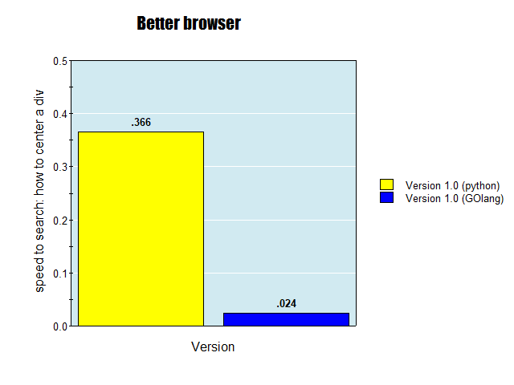

# BetterBrowser
A way to quickly search for a programing related questions from your terminal and have it open in your default browser. The google search results are specifically catered to support techies and programers. 

## Performance increase

Version one while still works great it isn't as fast as it could be. Since switching to GOlang it has become much faster. I also introduced more links to search from.

